# 02-从 Tool 开始：让大模型自动调工具读文件


我们和大模型聊天，可以问它一些问题，它告诉你怎么做。

但是大模型没法帮你去做。

比如你想创建一个 react + vite 的 todolist 项目，你直接问大模型，它只能告诉你应该创建哪些文件，代码是什么，但是不能帮你读写文件、执行命令。

但是 cursor 是可以的：

<video src="./assets/1.mp4"   controls />

你让它创建一个 todolist 项目，它会直接给你写入文件。

你还可以让它安装依赖，把项目跑起来：

<video src="./assets/2.mp4"  controls />

这是怎么实现的呢？

开发一些 tool 交给 agent 调用就可以了。

比如读文件、写文件、读取目录、创建目录、执行命令

这节我们来学下 tool：

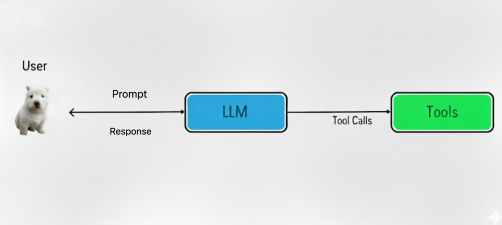

首先，我们找个大模型来用：

这里我们用阿里的千问，因为每个用户登录都有 100 万免费 token

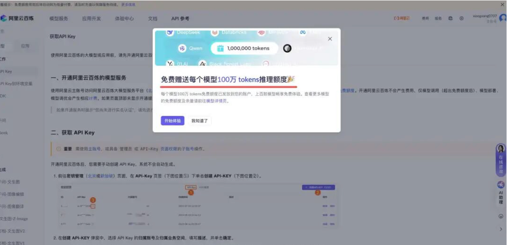

够我们学习用了。

当然，就算以后不免费了，买也没多少钱，几十块可以用很久了。

你用别的大模型也一样，都可以。

首先，登录下：

https://bailian.console.aliyun.com/?tab=api#/api

点这里获取 api key：

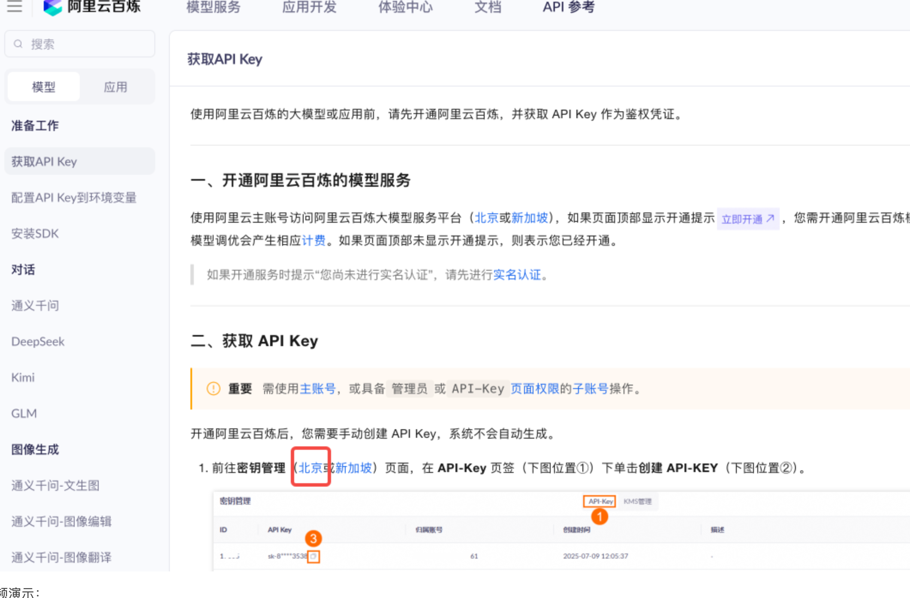

视频演示：

<video src="./assets/3.mp4"  controls />

然后就可以用 apikey 来调模型了

找个模型：

<video src="./assets/4.mp4"  controls />

搜 coder 相关的编码模型，这里是生成代码用。每个模型训练的数据集不同，都是用于不同目的。

我们用 qwen-coder-turbo 这个就行。

然后来写代码调用。

创建项目：

```plain&#x20;text
mkdir tool-test
cd tool-test
npm init -y
```

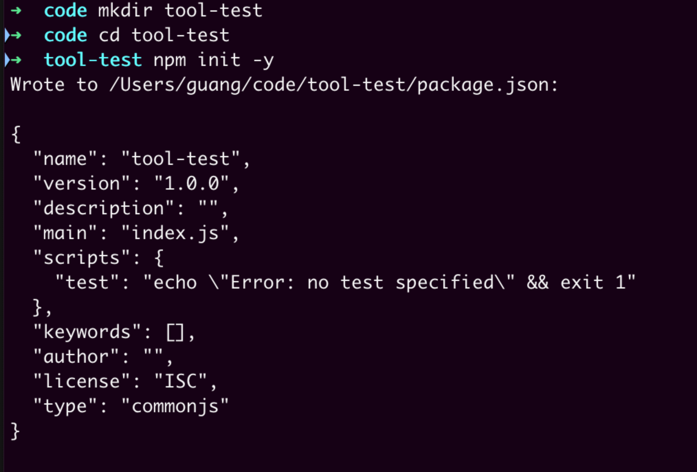

用编辑器打开，然后创建一个文件：

src/hello-langchain.mjs

mjs 是 es module 格式的 js 文件的意思，可以用 import、export 语法

```plain&#x20;text
import { ChatOpenAI } from '@langchain/openai';

const model = new ChatOpenAI({ 
    modelName: "qwen-coder-turbo",
    apiKey: '你的 apiKey',
    configuration: {
        baseURL: 'https://dashscope.aliyuncs.com/compatible-mode/v1',
    },
});

const response = await model.invoke("介绍下自己");
console.log(response.content);
```

这里的 api key 换成你刚才复制的，然后 base url 是这个：

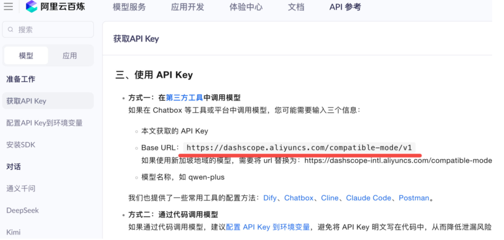

安装依赖：

```plain&#x20;text
pnpm install @langchain/openai
```

跑一下：

```plain&#x20;text
node ./src/hello-langchain.mjs
```

可以看到模型调用成功了。

不过这样把 api key 写死到代码里的方式不好，我们通过 .env 文件来管理，然后用 dotenv 这个包来读取

```plain&#x20;text
pnpm install dotenv
```

用 dotenv 来读取环境变量：

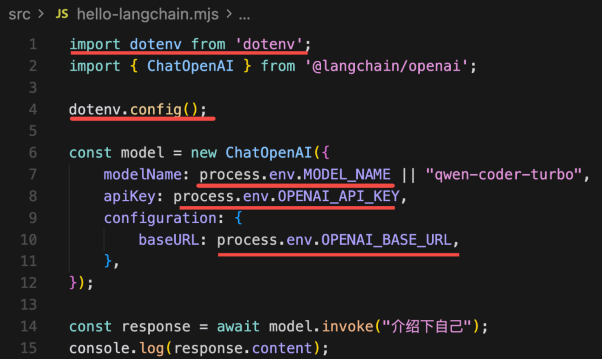

dotenv 的作用就是读取 .env 文件，设置到环境变量里

```plain&#x20;text
import dotenv from'dotenv';
import { ChatOpenAI } from'@langchain/openai';

dotenv.config();

const model = new ChatOpenAI({ 
    modelName: process.env.MODEL_NAME || "qwen-coder-turbo",
    apiKey: process.env.OPENAI_API_KEY,
    configuration: {
        baseURL: process.env.OPENAI_BASE_URL,
    },
});

const response = await model.invoke("介绍下自己");
console.log(response.content);
```

所以我们在 .env 文件里配置这些变量，代码里动态读取：

```plain&#x20;text
# OpenAI API 配置
OPENAI_API_KEY=你的 api key
OPENAI_BASE_URL=https://dashscope.aliyuncs.com/compatible-mode/v1

# 模型配置（可选，默认为 qwen-coder-turbo）
MODEL_NAME=qwen-coder-turbo
```

然后还要添加到 .gitignore，因为这些私密信息是不保存到 git 的，就像数据库的密码一样，都是私下里传文件，不会提交 git

<video src="./assets/5.mp4"  controls />

好了，准备工作结束！

接下来开发 tool：

其实也很简单，我们先写一个读文件的 tool：

创建 src/tool-file-read.mjs

```plain&#x20;text
import 'dotenv/config';
import { ChatOpenAI } from'@langchain/openai';
import { tool } from'@langchain/core/tools';
import { HumanMessage, SystemMessage, ToolMessage } from'@langchain/core/messages';
import fs from'node:fs/promises';
import { z } from'zod';

const model = new ChatOpenAI({ 
modelName: process.env.MODEL_NAME || "qwen-coder-turbo",
apiKey: process.env.OPENAI_API_KEY,
temperature: 0,
configuration: {
      baseURL: process.env.OPENAI_BASE_URL,
  },
});

const readFileTool = tool(
async ({ filePath }) => {
    const content = await fs.readFile(filePath, 'utf-8');
    console.log(`  [工具调用] read_file("${filePath}") - 成功读取 ${content.length} 字节`);
    return`文件内容:\n${content}`;
  },
  {
    name: 'read_file',
    description: '用此工具来读取文件内容。当用户要求读取文件、查看代码、分析文件内容时，调用此工具。输入文件路径（可以是相对路径或绝对路径）。',
    schema: z.object({
      filePath: z.string().describe('要读取的文件路径'),
    }),
  }
);

const tools = [
  readFileTool
];

const modelWithTools = model.bindTools(tools);

const messages = [
new SystemMessage(`你是一个代码助手，可以使用工具读取文件并解释代码。

工作流程：
1. 用户要求读取文件时，立即调用 read_file 工具
2. 等待工具返回文件内容
3. 基于文件内容进行分析和解释

可用工具：
- read_file: 读取文件内容（使用此工具来获取文件内容）
`),
new HumanMessage('请读取 src/tool-file-read.mjs 文件内容并解释代码')
];

let response = await modelWithTools.invoke(messages);
console.log(response);
```

这里需要用到 langchain 的核心包，以及 zod：

```plain&#x20;text
pnpm install @langchain/core zod
```

首先，创建一个模型 model

temperature 是温度，也就是 ai 的创造性，设置为 0，让它严格按照指令来做事情，不要自己发挥

我们没有调用 dotenv.configure，引入了这个模块就行

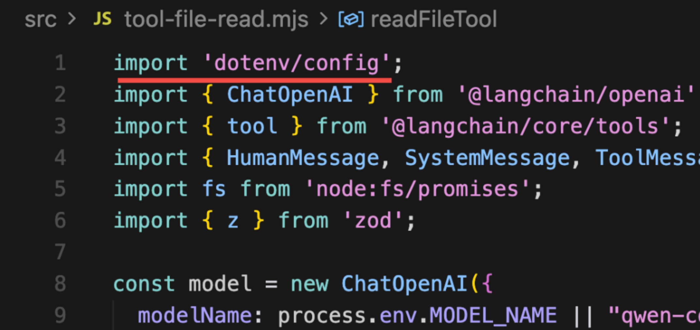

然后创建一个 tool，调用 tool 的 api

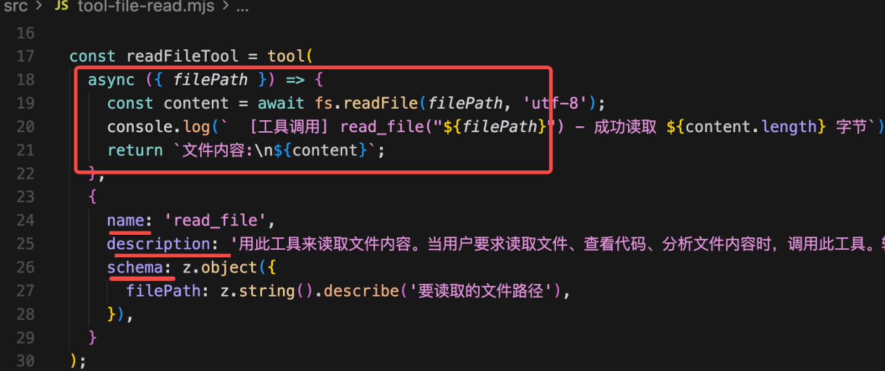

这个很容易看懂，就是函数以及它的名字、描述、参数格式。

因为要给大模型用，你要描述下这个工具是干什么的。

描述下参数的格式。

这里用 zod 包来描述，就是传入一个 object，里面的 filePath 是一个 string

也就是这样：

```plain&#x20;text
{
  filePath: 'xxx'
}
```

之后把这个 tool 传给大模型：

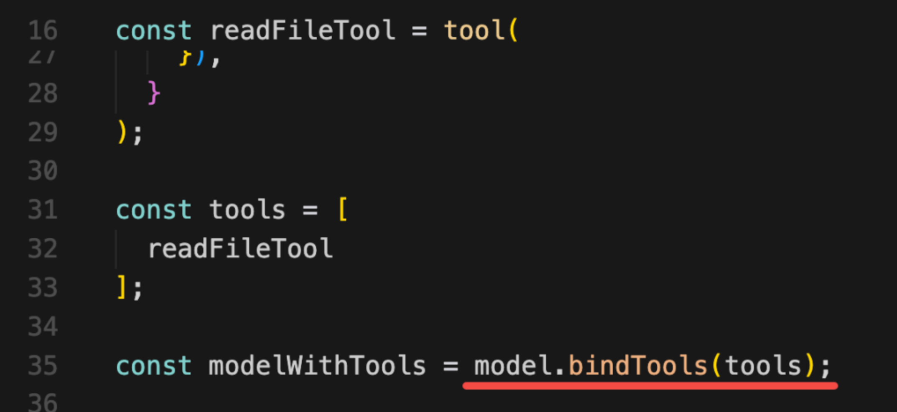

调用下：

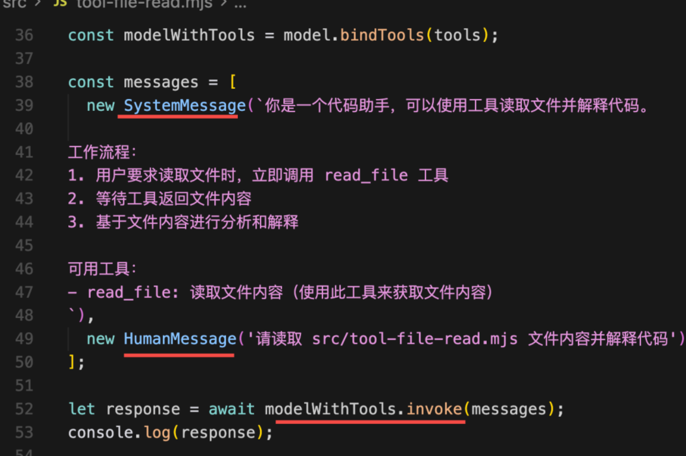

具体的消息有四种：SystemMessage、HumanMessage、AIMessage、ToolMessage

* **SystemMessage**：设置 AI 是谁，可以干什么，有什么能力，以及一些回答、行为的规范等

* **HumanMessage**：用户输入的信息

* **AIMessage**：AI 的回复信息

* **ToolMessage**：调用工具的结果返回

我们用 system message 告诉 ai，它是一个代码助手，可以读取文件并解释代码内容，给出建议

跑下试试：

```plain&#x20;text
node ./src/tool-file-read.mjs
```

<video src="./assets/6.mp4"  controls />

可以看到 AI 返回的消息是 AIMessage 实例

它返回了这个信息：

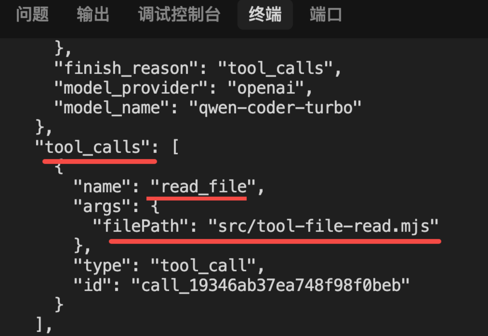

就是解析出来我们给的路径，拼接了调用工具的参数。

接下来我们基于这个参数调用下工具不就行了？

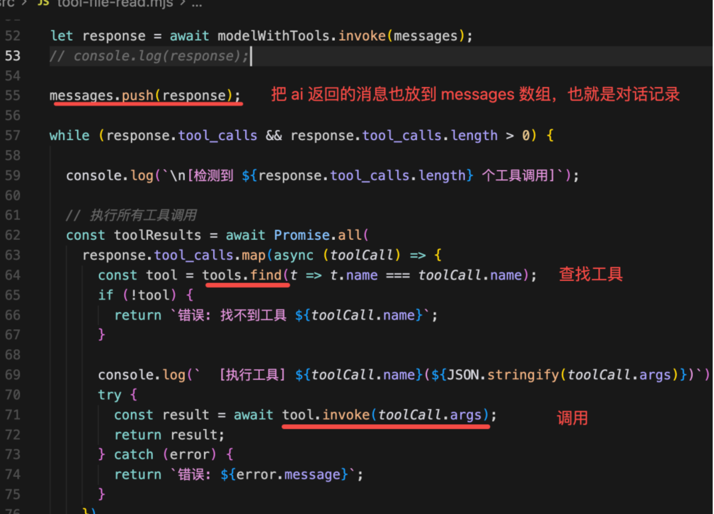

根据 tool\_calls 的数组，分别从 tools 数组里找到对应的工具，取出来 invoke，传入大模型解析出的参数

最后把工具调用结果作为 ToolMessage 传给大模型，让它继续回答：

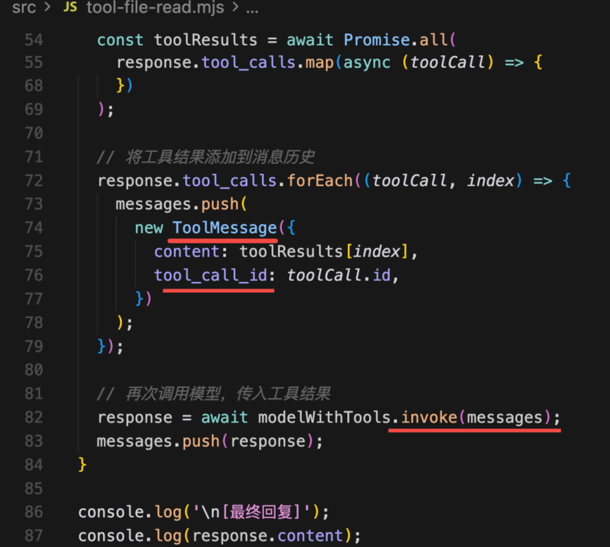

注意，这里要用 toolCall 对应的 id 来关联执行结果，也就是告诉大模型，你让我调用的哪个工具，返回的结果是什么

```plain&#x20;text

let response = await modelWithTools.invoke(messages);
// console.log(response);

messages.push(response);

while (response.tool_calls && response.tool_calls.length > 0) {

console.log(`\n[检测到 ${response.tool_calls.length} 个工具调用]`);

// 执行所有工具调用
const toolResults = awaitPromise.all(
    response.tool_calls.map(async (toolCall) => {
      const tool = tools.find(t => t.name === toolCall.name);
      if (!tool) {
        return`错误: 找不到工具 ${toolCall.name}`;
      }
      
      console.log(`  [执行工具] ${toolCall.name}(${JSON.stringify(toolCall.args)})`);
      try {
        const result = await tool.invoke(toolCall.args);
        return result;
      } catch (error) {
        return`错误: ${error.message}`;
      }
    })
  );

// 将工具结果添加到消息历史
  response.tool_calls.forEach((toolCall, index) => {
    messages.push(
      new ToolMessage({
        content: toolResults[index],
        tool_call_id: toolCall.id,
      })
    );
  });

// 再次调用模型，传入工具结果
  response = await modelWithTools.invoke(messages);
}

console.log('\n[最终回复]');
console.log(response.content);
```

跑下试试：

<video src="./assets/7.mp4"  controls />

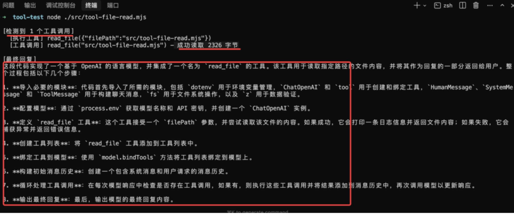

可以看到，检测到了 tool\_calls 工具调用，用 read\_file 这个工具读取了文件，然后让大模型分析了文件内容，给出了代码解释。

是不是现在大模型就能读文件了！

这就是通过工具给大模型扩展了能力。

> 代码上传了课程仓库： https://github.com/QuarkGluonPlasma/ai-agent-course-code

## <span style="color: rgb(46,161,33); background-color: inherit">总结</span>

这节我们入门了 langchain，调用了大模型，并且实现了第一个 tool

我们用的千问的模型，因为它有免费额度，获取 api key 后，用 .env 管理。

.env 这个文件不提交 git，都是聊天软件发送的方式口口相传，就和数据库密码一样。

我们用 tool 创建了一个工具，写一下函数，以及加下名字、描述、参数的格式（用 zod 声明）就可以了。

用 model.bindTools 传给大模型，在 system message 告诉它这个工具的信息，以及规范下它的回答流程。

message 分为 SystemMessage、HumanMessage、AIMessage、ToolMessage 四种

之后，直接问大模型某个代码的信息，它就会调用工具读取文件，然后来解答了。

实现了第一个 tool 之后，你可以想一下 cursor 怎么实现，后面我们实现一个简易版 cursor！