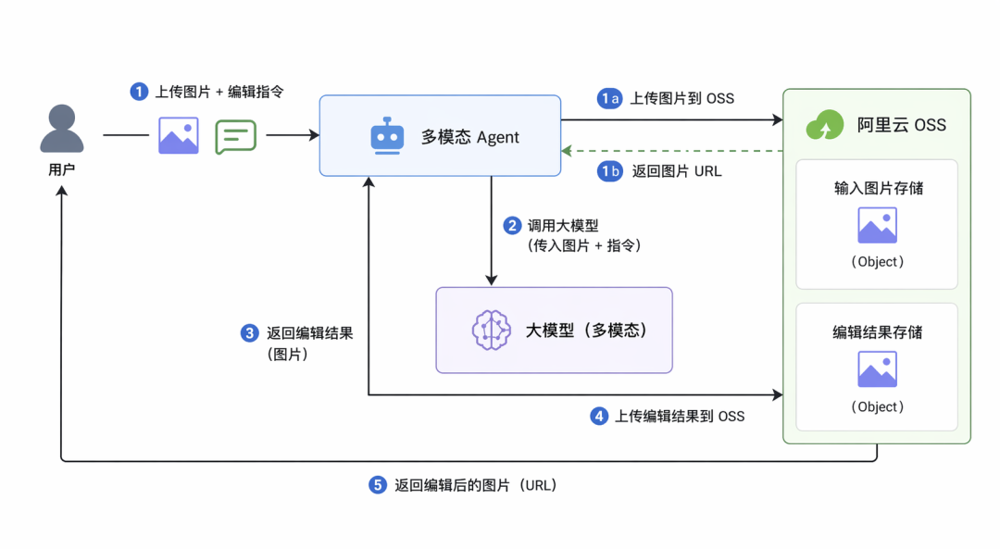
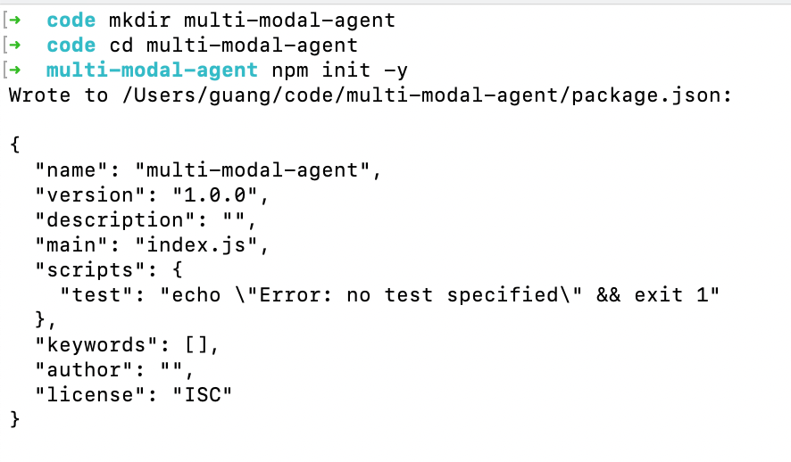
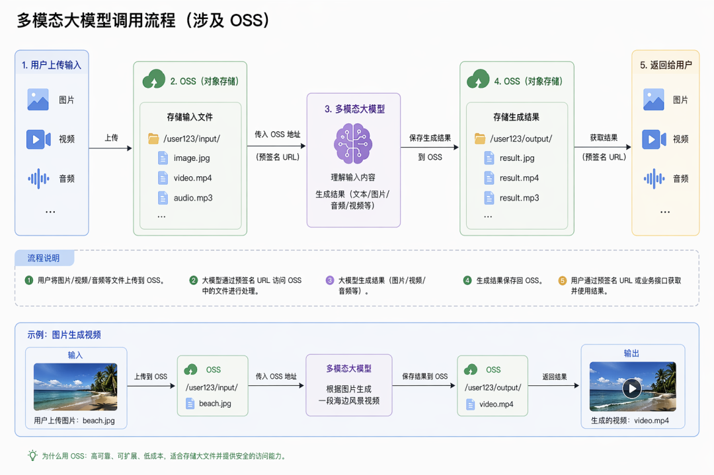
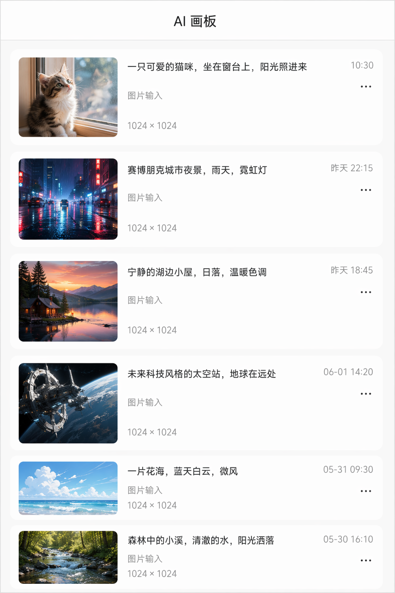
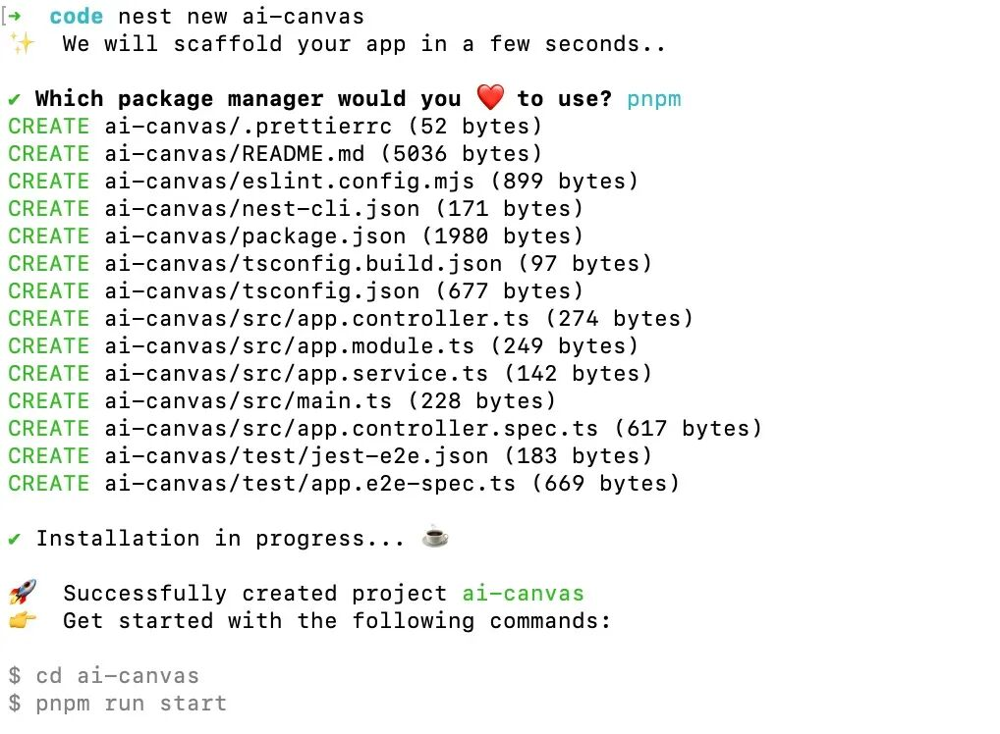
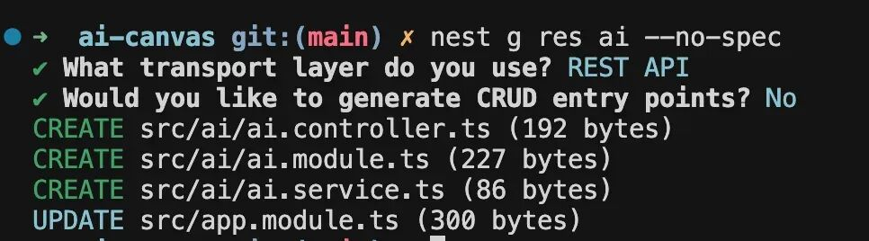
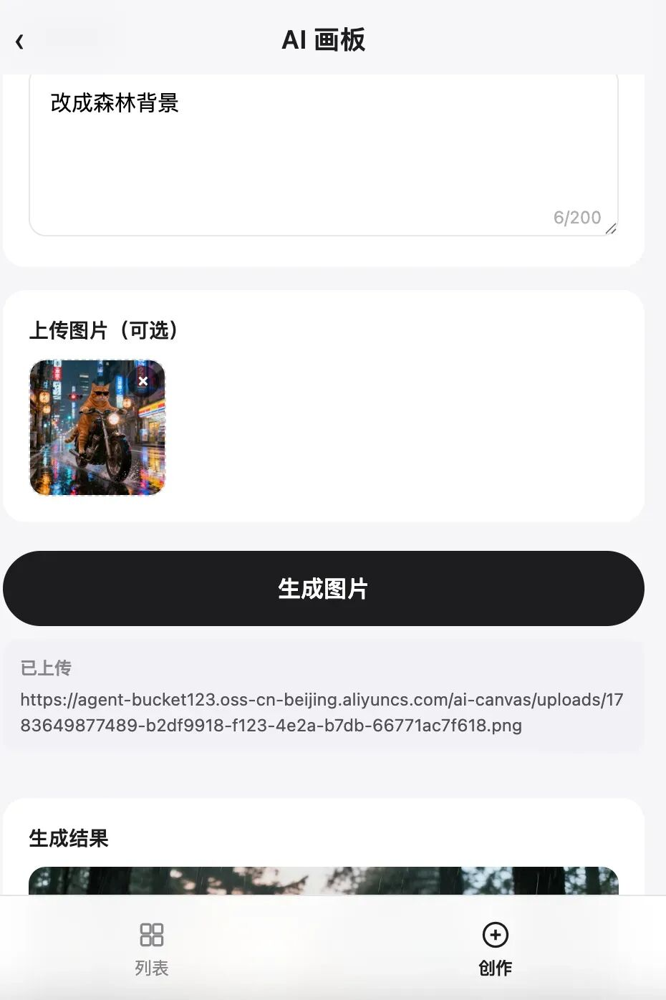
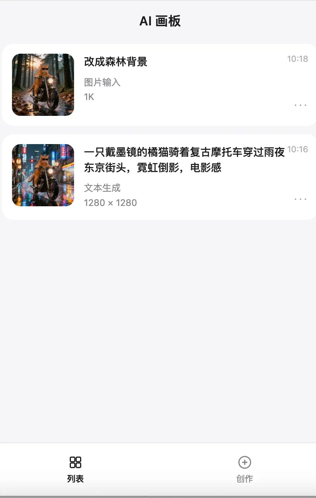

# 多模态与 OSS 前端直传实战：AI 画板

之前我们的 Agent 都是输入文字、返回文字。

但平时用的很多 Agent 都支持输入图片、返回图片


这是怎么实现的呢？

首先模型要用支持多模态的：

<video src="./videos/video_01_wxv_4594371682894872576.mp4" controls></video>


然后我们要用 OSS 来存储图片，拿到 url：

<video src="./videos/video_02_wxv_4594372960748240897.mp4" controls></video>



基于多模态的大模型 + OSS，我们就可以实现支持多模态的 Agent

创建项目：

```
mkdir multi-modal-agent
cd multi-modal-agent
npm init -y
```



安装依赖：

```
pnpm install @langchain/core @langchain/openai dashscope-sdk-official dotenv ali-oss
```

创建 src/image-understanding.mjs

```
/**
 * 图像理解 — qwen-vl-plus
 * DashScope OpenAI 兼容接口 + ChatOpenAI
 */
import'dotenv/config';
import { ChatOpenAI } from'@langchain/openai';
import { HumanMessage } from'@langchain/core/messages';

const model = new ChatOpenAI({
apiKey: process.env.OPENAI_API_KEY,
model: 'qwen-vl-plus',
configuration: {
    baseURL: process.env.OPENAI_BASE_URL,
  },
});

const response = await model.invoke([
new HumanMessage({
    content: [
      { type: 'text', text: '详细描述这张图片的内容' },
      {
        type: 'image_url',
        image_url: {
          url: 'https://dashscope.oss-cn-beijing.aliyuncs.com/./images/dog_and_girl.jpeg',
        },
      },
    ],
  }),
]);

console.log('model: qwen-vl-plus');
console.log(response.content);
```

其余案例代码从仓库复制。

跑一下：

<video src="./videos/video_03_wxv_4594374995606503425.mp4" controls></video>

兼容 openai 协议的大模型就可以用 ChatOpenAI 来调用，其余的直接用 dashscope 的 SDK 来调。

这个过程涉及到了 OSS，传入的图片、视频、音频 url、生成的视频、音频、图片的保存等。



我们来完整实现下这个流程。

生成图片传到 OSS 直接后端做就行，返回 oss 的 url

但是用户上传视频，有必要先传到我们服务器，再传到 oss 么？

没必要，这种可以用 OSS 直传。


阿里云文档里有写：

https://help.aliyun.com/zh/oss/user-guide/uploading-objects-to-oss-directly-from-clients/

（微信最近文章内容不能复制了，代码部分可以直接从仓库复制，文字可以截图让豆包之类的提取）

<video src="./videos/video_04_wxv_4594376755536297987.mp4" controls></video>

写一下生成 sts 的代码：

src/sts-gen.mjs

```
import 'dotenv/config';
import OSS from'ali-oss';

asyncfunction main() {

    const config = {
        region: 'oss-cn-beijing',
        bucket: 'agent-bucket123',
        accessKeyId: process.env.OSS_ACCESS_KEY_ID,
        accessKeySecret: process.env.OSS_ACCESS_KEY_SECRET,
    }

    const client = new OSS(config);

    const date = newDate();

    date.setDate(date.getDate() + 1);

    const res = client.calculatePostSignature({
        expiration: date.toISOString(),
        conditions: [
            ["content-length-range", 0, 1048576000], //设置上传文件的大小限制。
        ]
    });

    console.log(res);

    const location = await client.getBucketLocation();

    const host = `http://${config.bucket}.${location.location}.aliyuncs.com`;

    console.log(host);
}

main();
```

创建一个前端的 html

public/index.html

```
<!DOCTYPE html>
<html lang="en">
<head>
    <meta charset="UTF-8">
    <meta name="viewport" content="width=device-width, initial-scale=1.0">
    <title>Document</title>
    <script src="https://unpkg.com/axios@1.6.5/dist/axios.min.js"></script>
</head>
<body>
    <input id="fileInput" type="file"/>

    <script>
        const fileInput = document.getElementById('fileInput');

        asyncfunctiongetOSSInfo() {
            await'请求应用服务器拿到临时凭证';
            return {
                OSSAccessKeyId: '',
                Signature: '',
                policy: '',
                host: ''
            }
        }

        fileInput.onchange = async () => {
            const file = fileInput.files[0];

            const ossInfo = await getOSSInfo();

            const formdata = new FormData()

            formdata.append('key', file.name);
            formdata.append('OSSAccessKeyId', ossInfo.OSSAccessKeyId)
            formdata.append('policy', ossInfo.policy)
            formdata.append('signature', ossInfo.Signature)
            formdata.append('success_action_status', '200')
            formdata.append('file', file)

            const res = await axios.post(ossInfo.host, formdata);
            if(res.status === 200) {

                const img = document.createElement('img');
                img.src = ossInfo.host + '/' + file.name
                document.body.append(img);

                alert('上传成功');
            }
        }
    </script>
</body>
</html>
```

跑一下：

<video src="./videos/video_05_wxv_4594377498398081028.mp4" controls></video>

多模态大模型调用、前端直传 OSS 都跑通了，我们来做一个小实战：AI 画板。




先来写一下后端的接口：

```
nest new ai-canvas
```



进入项目，创建个新模块：

```
nest g res ai --no-spec
```



安装依赖：

```
pnpm install dashscope-sdk-official dotenv ali-oss  @nestjs/config @nestjs/serve-static
```

把我们前面写的那个图片修改的逻辑拿过来，放到 service 里：

具体代码从仓库复制。

<video src="./videos/video_06_wxv_4597935188352974851.mp4" controls></video>





这样我们就把前端直传 OSS，与多模态大模型，综合用了一遍。

**总结**

Agent 很多都支持多模态，比如上传图片识别、生成图片、视频等。

我们用了一下多模态的大模型，阿里的模型有的不支持 openai 协议，需要用 dashscope 的 sdk 来调用。

生成的图片、视频等会放到临时的 oss，有效期大概 24 小时，我们要传到自己的 oss 持久保存。

我们实现了前端直传 OSS，服务端只返回 sts 信息就可以了。

然后把多模态大模型与前端直传 oss 做了一个综合的小实战：AI 画板。

前端直传 OSS + 多模态大模型，会免回经常用到。
