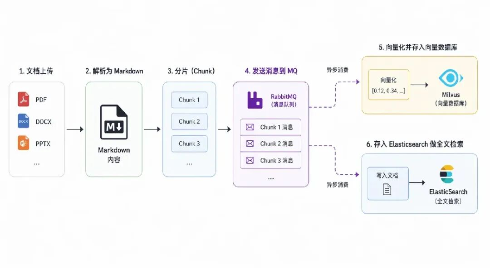
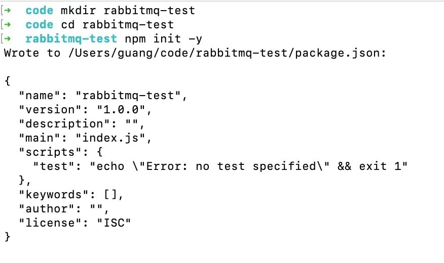
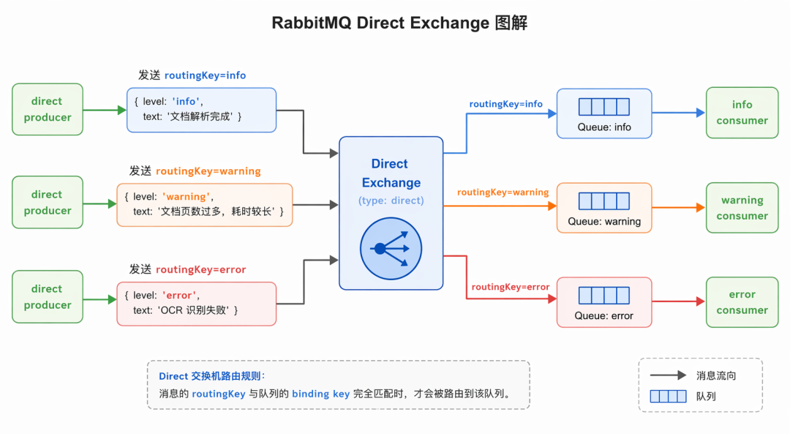
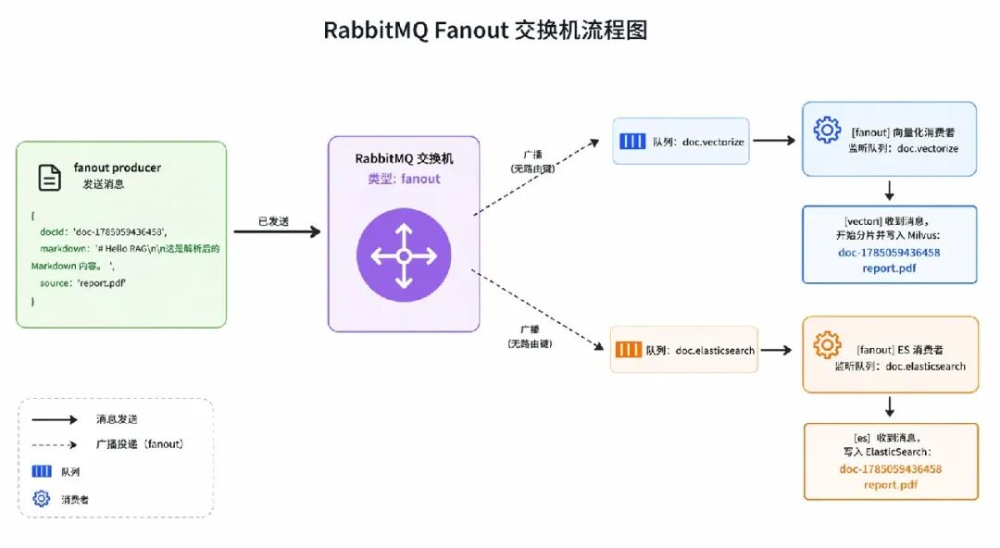
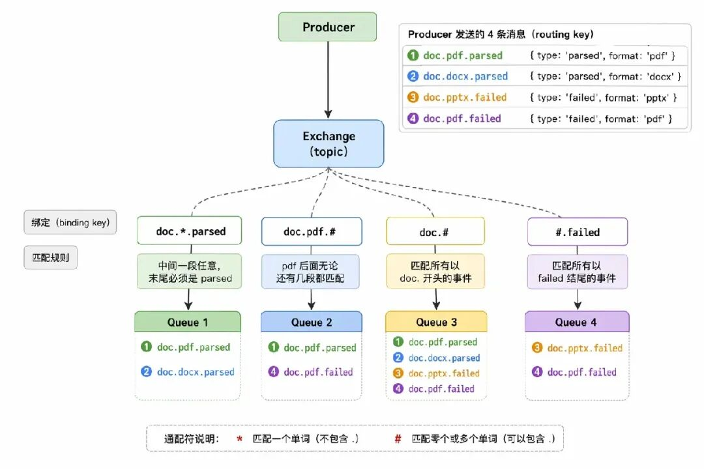
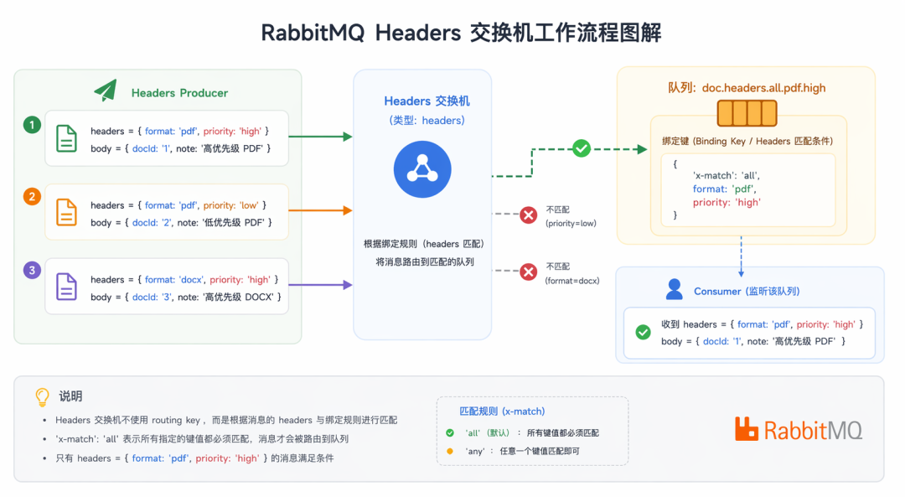
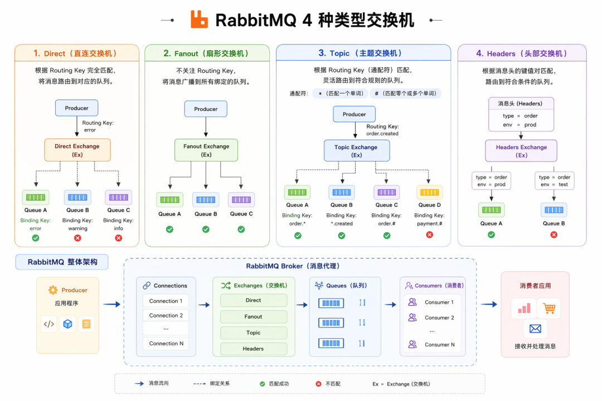

# RabbitMQ：Agent 中异步处理的标配方案

RAG 流程里，pdf、docx、pptx 等各类文档上传后会解析为 markdown 格式

然后会分片存入向量数据库（比如 Milvus），会存入 ElasticSearch 做全文检索。

那解析的接口做向量化、ES 存储，需要同步等它们完成么？

很明显没必要，这俩完全可以异步来做。

后端如果想做异步处理，一般都是用消息队列 MQ，比如 RabbitMQ



解析完文档得到 Markdown 后，往 MQ 发一条消息

两个消费者收到消息后，分别做不同的处理。

RabbitMQ 的架构是这样的：


Producer 和 Consumer 分别是生产者和消费者。

Connection 是客户端与 RabbitMQ 服务之间的 TCP 物理连接。

我们不会每次收发消息都新建独立 Connection，因为 TCP 连接创建开销较高；

所以在一条 Connection 内部划分多条逻辑通道，也就是 Channel。

生产者和消费者都是绑定到具体的 channel 来收发消息。

Queue 队列，是真正存放消息的容器，消息最终存在队列中等待消费者处理。

整套承载消息接收、路由、转发的 RabbitMQ 服务实例，统称为 Broker。

至于 Exchange，这个是把消息放到不同的队列里用的，叫做交换机。

它负责把我们发的消息按照规则放入不同的 Queue 里

Exchange 主要有 4 种：

- fanout：把消息放到这个交换机的所有 Queue
- direct：把消息放到交换机的指定 key 的队列
- topic：把消息放到交换机的指定 key 的队列，支持模糊匹配
- headers：把消息放到交换机的满足某些 header 的队列

我们分别来试一下：

```
mkdir rabbitmq-test
cd rabbitmq-test
npm init -y
```



先创建 docker-compose.yml 把它跑起来：

```
services:
  rabbitmq:
    image: rabbitmq:3.13-management
    container_name: rabbitmq
    restart: always
    ports:
      - "5672:5672"
      - "15672:15672"
    environment:
      RABBITMQ_DEFAULT_USER: admin
      RABBITMQ_DEFAULT_PASS: Admin@123456
      RABBITMQ_DEFAULT_VHOST: /
    volumes:
      - ./rabbitmq_data:/var/lib/rabbitmq
```

<video src="./videos/video_01_wxv_4621617201211621378.mp4" controls></video>

然后我们代码连上

nodejs 链接 rabbitmq 是用 amqplib 这个包：

```
pnpm install amqplib
```

先跑一下 direct 类型交换机（代码从仓库复制）：

<video src="./videos/video_02_wxv_4621617842369069057.mp4" controls></video>

这种交换机，会根据消息的 routing key 把消息传给精确匹配 routing key 的队列



然后是 fanout 类型的交换机：

<video src="./videos/video_03_wxv_4621619556414078978.mp4" controls></video>

这种交换机，不看 routing key，会把收到的消息广播到所有绑定的队列



然后是 topic 类型的交换机

<video src="./videos/video_04_wxv_4621620250487128066.mp4" controls></video>

这个类型的交换机是根据通配符类匹配

- 是匹配任意一个段

# 是匹配0 到任意个段



最后来看一下 headers 类型

<video src="./videos/video_05_wxv_4621621582078377990.mp4" controls></video>

headers 类型的交换机不再看 routing key，而是根据 headers 来匹配



这样，4 种交换机类型我们就都过了一遍。



> 代码上传了课程仓库： https://github.com/QuarkGluonPlasma/ai-agent-course-code

**总结**

这节我们学了 RabbitMQ。

后端的异步任务基本都是通过 mq 来做。

生产者往队列里存入消息，消费者取出来处理，整个过程是异步的。

我们学了 RabbitMQ 的架构，包括 Connection、Channel、Exchange、Queue、Producer、Consumer 这些概念

以及 4 种交换机类型：direct、topic、fanout、headers

后面 Agent 应用涉及到异步的场景，都会用 RabbitMQ 来实现。
